# AfriTalent 
Projet fil rouge — Plateforme de mise en relation entre freelances africains et 
clients. 
Auteur : Maureen ZOUNGRANA
Promotion : L1 DSBD — ISI 

## Présentation

AfriTalent est une plateforme web qui met en relation les talents africains (freelances) et les clients à la recherche de compétences professionnelles dans divers domaines tels que le développement web, le design graphique, la rédaction ou encore la data science.

## Objectifs

* Valoriser les compétences des talents africains.
* Faciliter la recherche de missions professionnelles.
* Mettre en relation freelances et clients.
* Offrir une plateforme moderne, intuitive et responsive.

## Technologies utilisées

* HTML5
* CSS3
* JavaScript
* Bootstrap 5
* Git & GitHub

## Structure du projet

ZOUNGRANA-Maureen-AfriTalent/ 
├── index.html 
├── freelances.html 
├── tarifs.html 
├── about.html 
├── contact.html 
├── css/ 
│   └── style.css 
├── js/ 
│   └── main.js 
├── images/ 
│   └── (vos images, logos, avatars) 
├── docs/ 
│   └── NOM_Prenom_Presentation.pptx 
├── README.md 
└── .gitignore 

## Fonctionnalités

* Navigation responsive
* Présentation des freelances
* Section tarifs
* Formulaire de contact
* Animations au défilement avec IntersectionObserver
* Design moderne et accessible

## Captures d'écran

### Page d'accueil

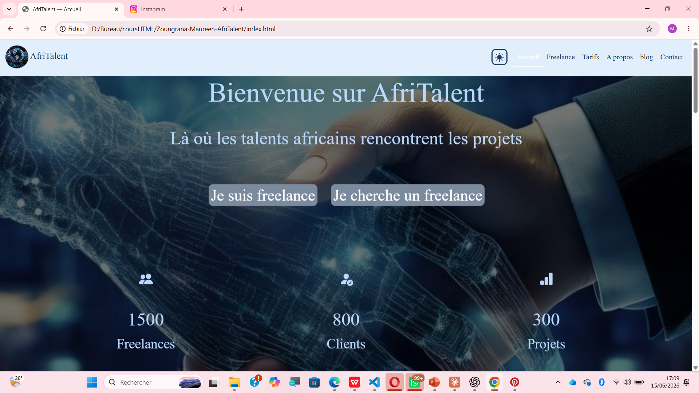
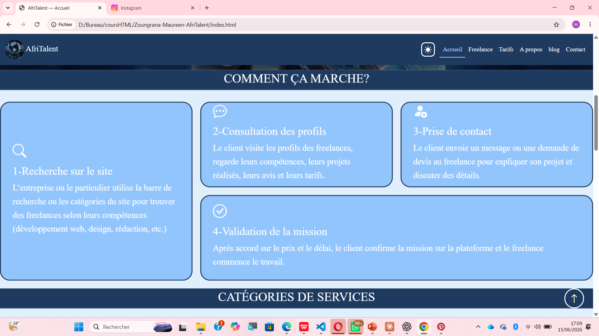
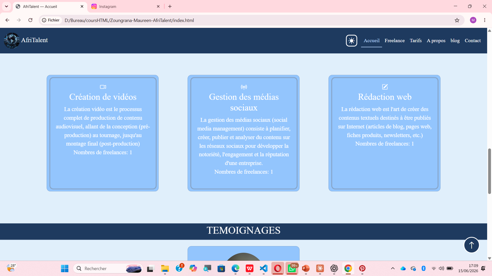
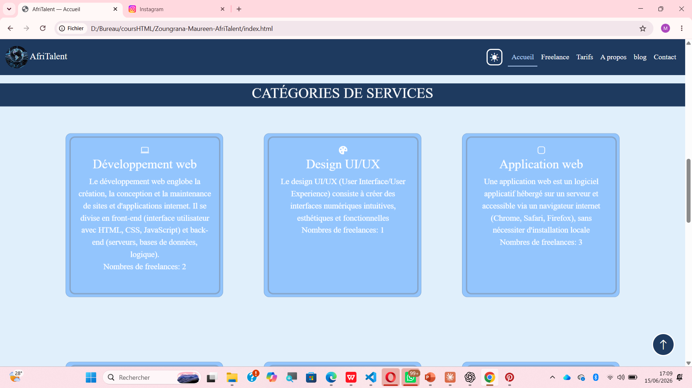
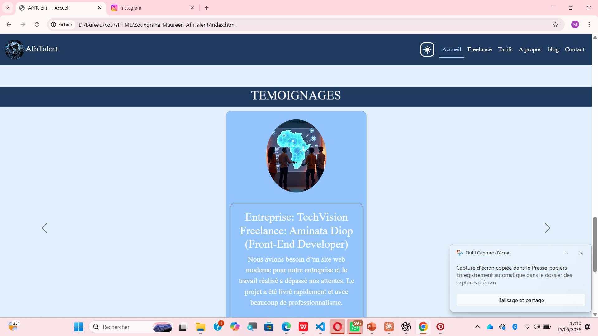
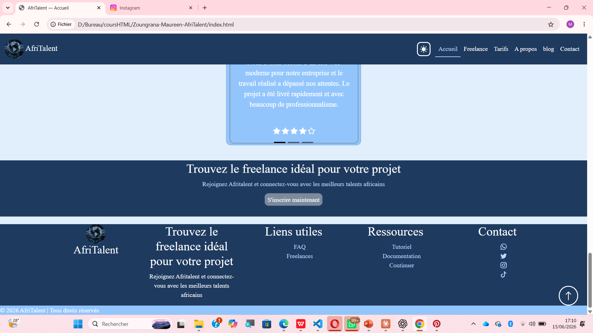

### Page Freelances

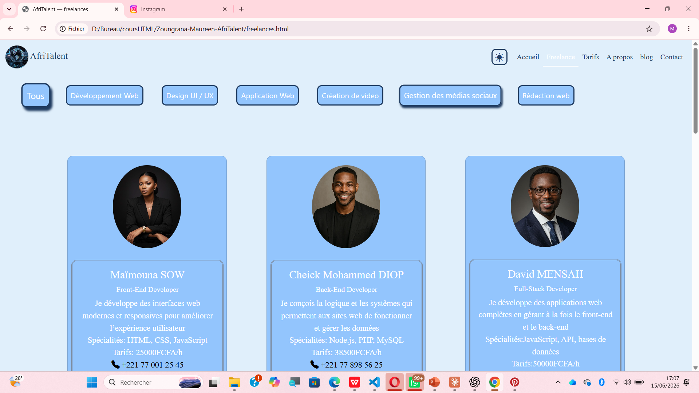
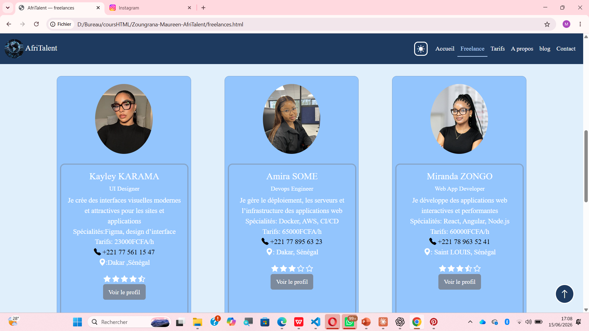
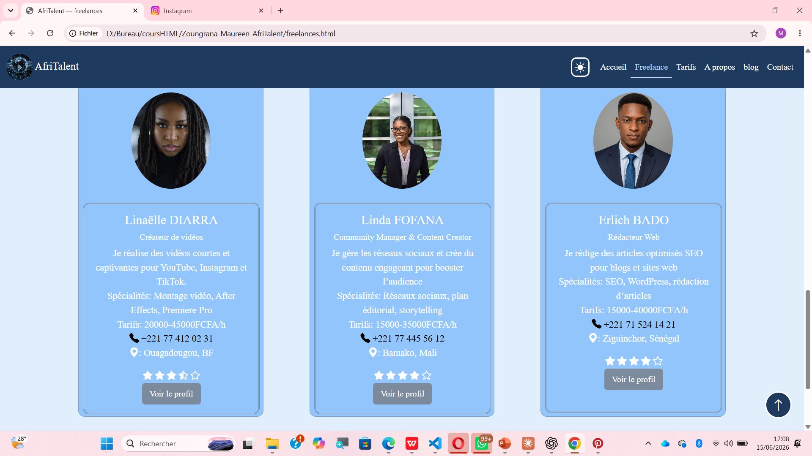
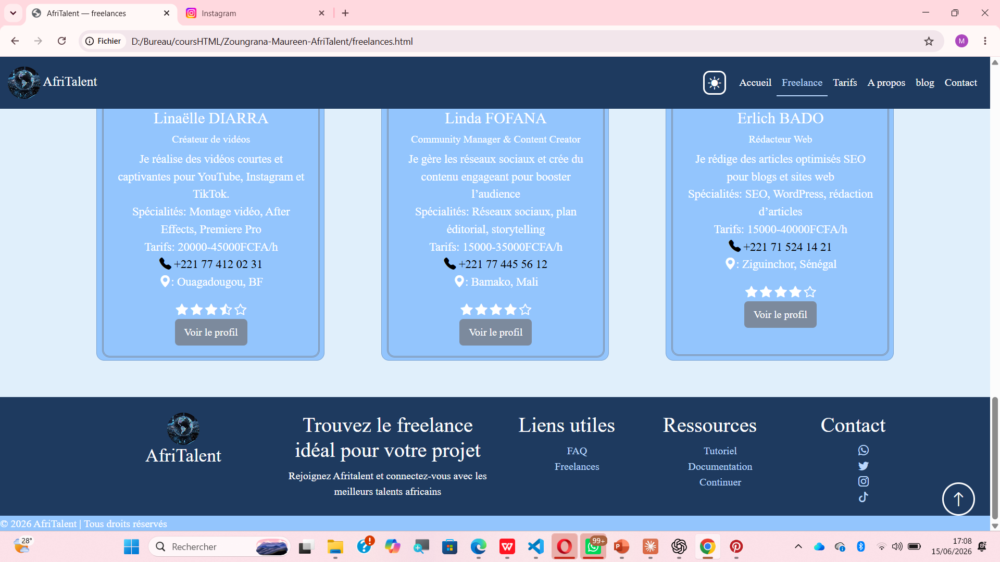

### Page Tarifs

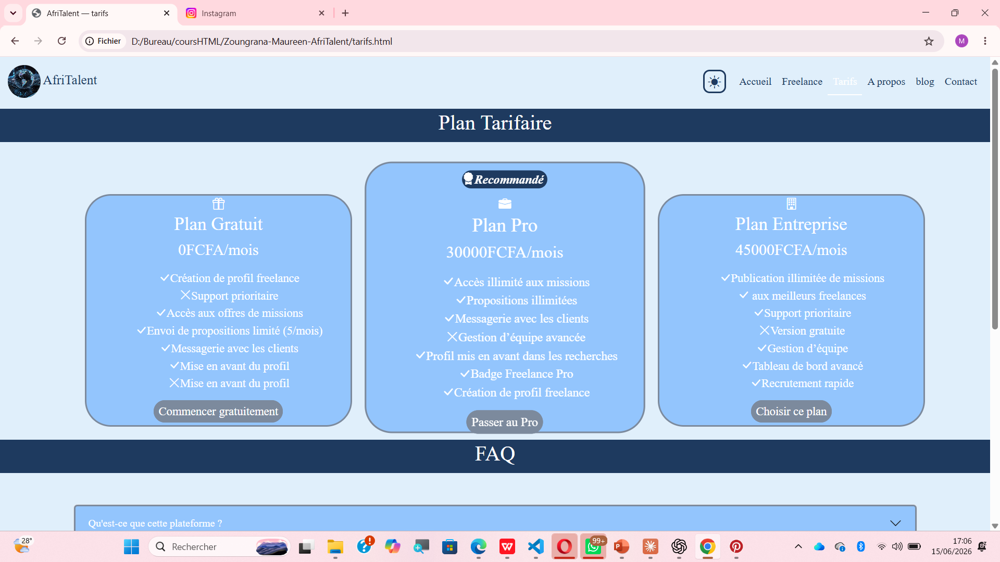
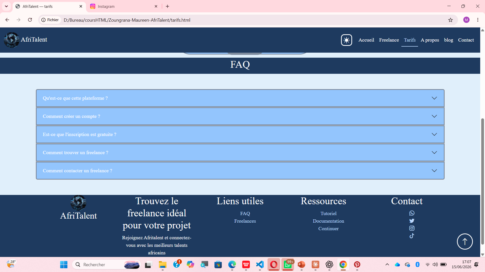

### Page À propos

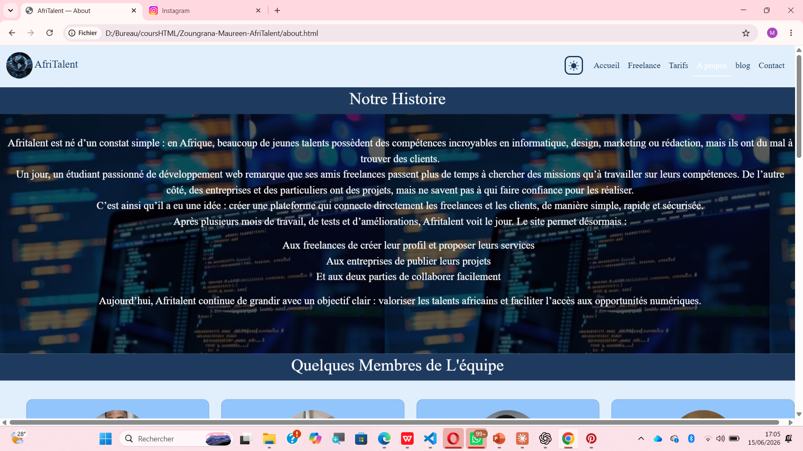
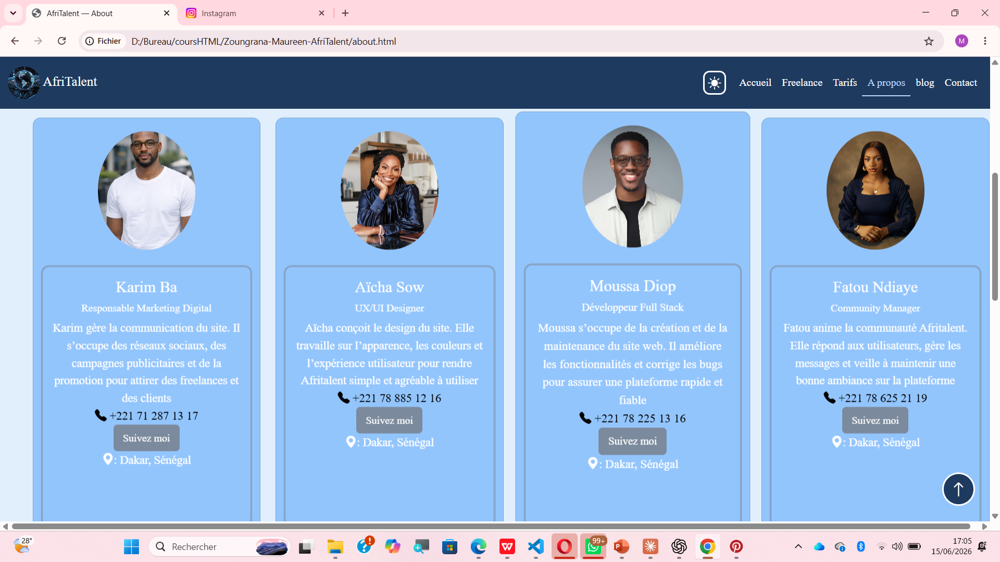
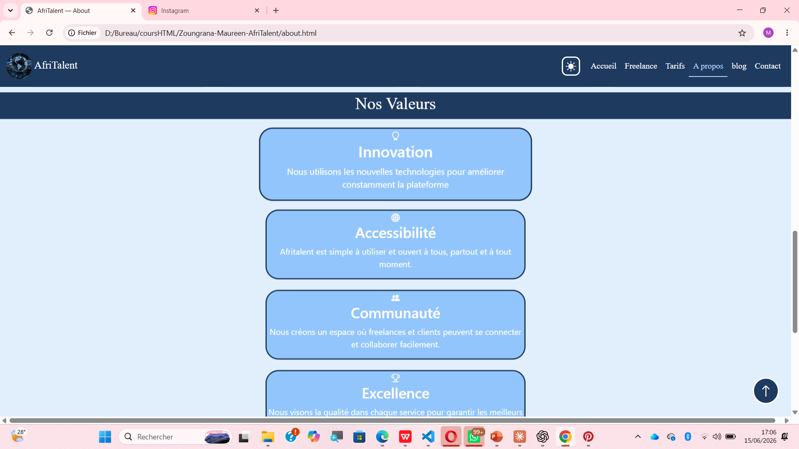
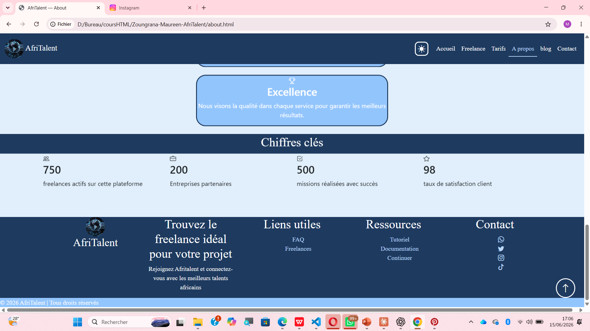

### Page Contact

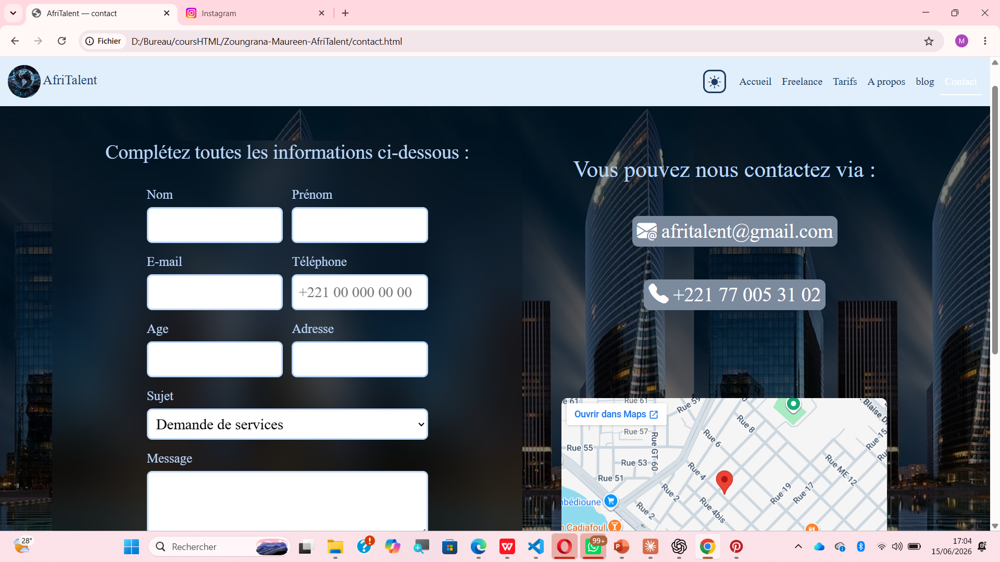
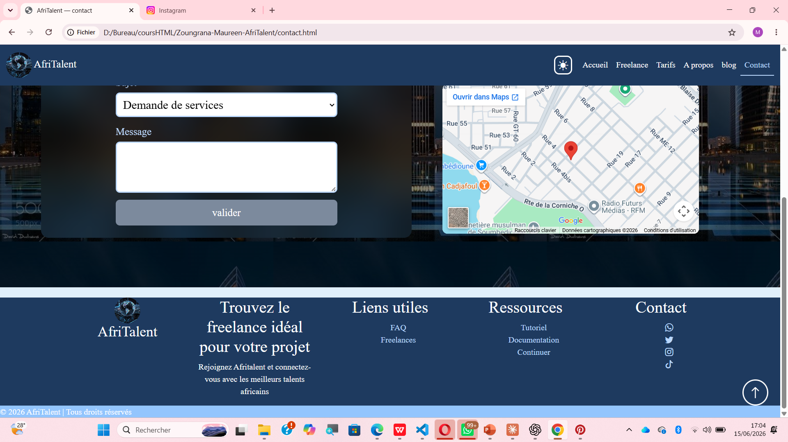

## Choix de design

### Palette de couleurs

* #BBD8FE
* rgb(30, 58, 95)
* rgb(124, 138, 157)
* #93C5FD
* rgb(224, 239, 251)

Ces couleurs ont été choisies pour transmettre la confiance, le professionnalisme et la modernité.

### Polices

* Roboto Slab : titres
* Playfair Display : contenu

## Installation

1. Cloner le dépôt GitHub :

git clone https://github.com/maureenzoungrana-max/ZOUNGRANA-Maureen-AfriTalent.git

2. Ouvrir le dossier du projet.

3. Lancer le fichier `index.html` dans un navigateur.

## Difficultés rencontrées

* Mise en place du responsive design sur différentes tailles d'écran.
* Validation du code HTML et correction des erreurs W3C.

## Améliorations futures

* Base de données pour les profils.
* Messagerie entre freelances et clients.
* Avis et évaluations.
* Développement d'une API et d'un backend.